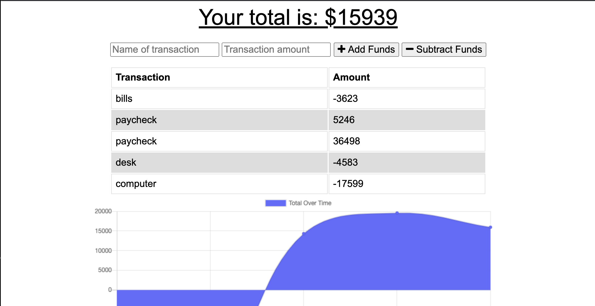

## Track-My-Spending

    
## Description

Application that lets user keeptrack if finances by simply adding or subtracting transactions, it has a chart which shows how much yoy have spent and how many transactions the user has made.
 
## Images of Deployed App

## Table of Contents
* [Installation](#installation)
* [Usage](#usage)
* [License](#license)
* [Test](#test)
* [Contributors](#contributors)
* [Questions](#questions)

## Installation

VS code installed in computer, and npm packages that are in the code files

 ## Usage
    
The user using the app will have the freedom of adding and subtracting transactions af the ammount they vhose to see hoe good or bad their buget and spending are.
    
## License

Lincenses used: MIT

## Test

Have VS scode installed, run NMP init and NPM start

## Contributors

Jose Morales

## Questions

GitHub: https://github.com/jmoarles072095

Contact Me: jmorales072095@gmail.com
    